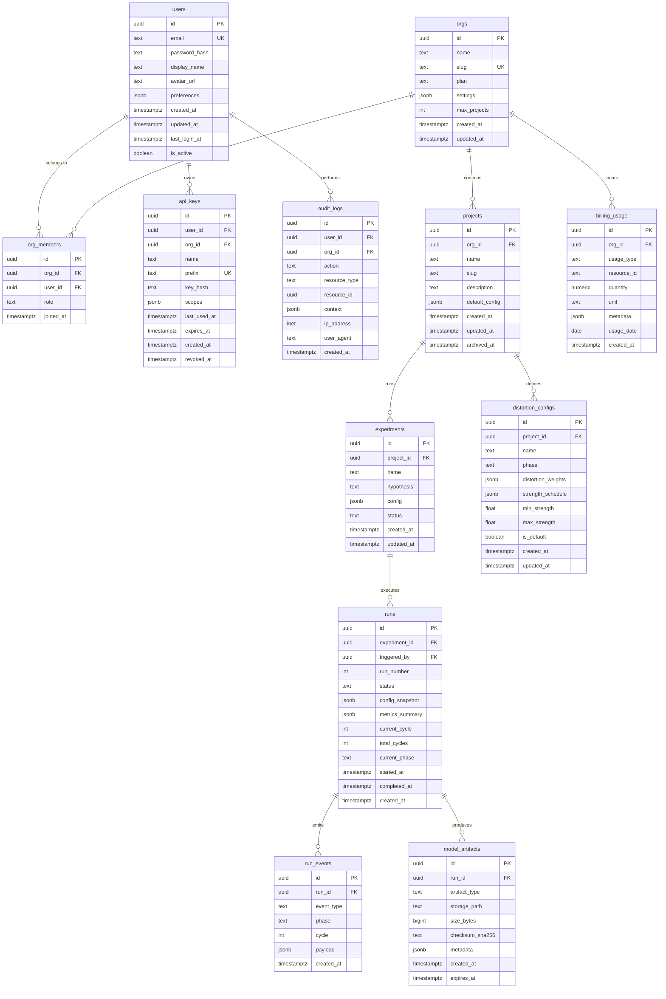

# NightmareNet — Database Schema Design

> Hosted platform schema for multi-tenant experiment tracking, billing, and audit.

## Entity-Relationship Diagram



---

## Table Definitions

### `users`

Primary identity table for platform accounts.

| Column | Type | Constraints | Notes |
|--------|------|-------------|-------|
| `id` | `uuid` | PK, DEFAULT gen_random_uuid() | |
| `email` | `text` | UNIQUE, NOT NULL | Normalized lowercase |
| `password_hash` | `text` | NOT NULL | Argon2id |
| `display_name` | `text` | NOT NULL | 1–100 chars |
| `avatar_url` | `text` | | nullable |
| `preferences` | `jsonb` | DEFAULT '{}' | Theme, notifications |
| `created_at` | `timestamptz` | NOT NULL, DEFAULT now() | |
| `updated_at` | `timestamptz` | NOT NULL, DEFAULT now() | |
| `last_login_at` | `timestamptz` | | |
| `is_active` | `boolean` | NOT NULL, DEFAULT true | Soft-disable |

### `orgs`

Multi-tenant organization (workspace) container.

| Column | Type | Constraints | Notes |
|--------|------|-------------|-------|
| `id` | `uuid` | PK, DEFAULT gen_random_uuid() | |
| `name` | `text` | NOT NULL | Display name |
| `slug` | `text` | UNIQUE, NOT NULL | URL-safe, 3–40 chars |
| `plan` | `text` | NOT NULL, DEFAULT 'free' | free / pro / enterprise |
| `settings` | `jsonb` | DEFAULT '{}' | Feature flags, limits |
| `max_projects` | `int` | NOT NULL, DEFAULT 5 | Plan-enforced cap |
| `created_at` | `timestamptz` | NOT NULL, DEFAULT now() | |
| `updated_at` | `timestamptz` | NOT NULL, DEFAULT now() | |

### `org_members`

Junction table: user ↔ org membership with role.

| Column | Type | Constraints | Notes |
|--------|------|-------------|-------|
| `id` | `uuid` | PK, DEFAULT gen_random_uuid() | |
| `org_id` | `uuid` | FK → orgs(id) ON DELETE CASCADE, NOT NULL | |
| `user_id` | `uuid` | FK → users(id) ON DELETE CASCADE, NOT NULL | |
| `role` | `text` | NOT NULL, DEFAULT 'member' | owner / admin / member / viewer |
| `joined_at` | `timestamptz` | NOT NULL, DEFAULT now() | |

**Constraint**: UNIQUE(org_id, user_id)

### `projects`

Logical grouping of experiments within an org.

| Column | Type | Constraints | Notes |
|--------|------|-------------|-------|
| `id` | `uuid` | PK, DEFAULT gen_random_uuid() | |
| `org_id` | `uuid` | FK → orgs(id) ON DELETE CASCADE, NOT NULL | |
| `name` | `text` | NOT NULL | 1–100 chars |
| `slug` | `text` | NOT NULL | Unique within org |
| `description` | `text` | | Optional long description |
| `default_config` | `jsonb` | DEFAULT '{}' | Base config for new experiments |
| `created_at` | `timestamptz` | NOT NULL, DEFAULT now() | |
| `updated_at` | `timestamptz` | NOT NULL, DEFAULT now() | |
| `archived_at` | `timestamptz` | | NULL = active |

**Constraint**: UNIQUE(org_id, slug)

### `experiments`

A named hypothesis with configuration; groups multiple runs.

| Column | Type | Constraints | Notes |
|--------|------|-------------|-------|
| `id` | `uuid` | PK, DEFAULT gen_random_uuid() | |
| `project_id` | `uuid` | FK → projects(id) ON DELETE CASCADE, NOT NULL | |
| `name` | `text` | NOT NULL | |
| `hypothesis` | `text` | | Free-text description |
| `config` | `jsonb` | NOT NULL | Full NightmareNet config |
| `status` | `text` | NOT NULL, DEFAULT 'draft' | draft / active / completed / archived |
| `created_at` | `timestamptz` | NOT NULL, DEFAULT now() | |
| `updated_at` | `timestamptz` | NOT NULL, DEFAULT now() | |

### `runs`

Single execution of an experiment's config. Tracks phase progress.

| Column | Type | Constraints | Notes |
|--------|------|-------------|-------|
| `id` | `uuid` | PK, DEFAULT gen_random_uuid() | |
| `experiment_id` | `uuid` | FK → experiments(id) ON DELETE CASCADE, NOT NULL | |
| `triggered_by` | `uuid` | FK → users(id) ON DELETE SET NULL | Who started it |
| `run_number` | `int` | NOT NULL | Monotonic per experiment |
| `status` | `text` | NOT NULL, DEFAULT 'queued' | queued / running / completed / failed / cancelled |
| `config_snapshot` | `jsonb` | NOT NULL | Immutable copy at run start |
| `metrics_summary` | `jsonb` | DEFAULT '{}' | Final aggregated metrics |
| `current_cycle` | `int` | DEFAULT 0 | Live progress |
| `total_cycles` | `int` | NOT NULL | From config |
| `current_phase` | `text` | | wake / dream / nightmare / compress |
| `started_at` | `timestamptz` | | Set when status → running |
| `completed_at` | `timestamptz` | | Set on terminal status |
| `created_at` | `timestamptz` | NOT NULL, DEFAULT now() | |

**Constraint**: UNIQUE(experiment_id, run_number)

### `run_events`

Time-series log of events emitted during a run (phases, metrics, errors).

| Column | Type | Constraints | Notes |
|--------|------|-------------|-------|
| `id` | `uuid` | PK, DEFAULT gen_random_uuid() | |
| `run_id` | `uuid` | FK → runs(id) ON DELETE CASCADE, NOT NULL | |
| `event_type` | `text` | NOT NULL | phase_start / phase_end / metric / error / checkpoint |
| `phase` | `text` | | wake / dream / nightmare / compress |
| `cycle` | `int` | | Current cycle number |
| `payload` | `jsonb` | NOT NULL, DEFAULT '{}' | Event-specific data |
| `created_at` | `timestamptz` | NOT NULL, DEFAULT now() | |

**Partitioning**: Range-partition on `created_at` (monthly) for efficient retention.

### `model_artifacts`

Stored model checkpoints, distilled outputs, and evaluation reports.

| Column | Type | Constraints | Notes |
|--------|------|-------------|-------|
| `id` | `uuid` | PK, DEFAULT gen_random_uuid() | |
| `run_id` | `uuid` | FK → runs(id) ON DELETE SET NULL, NOT NULL | |
| `artifact_type` | `text` | NOT NULL | checkpoint / distilled / onnx / evaluation_report |
| `storage_path` | `text` | NOT NULL | S3/GCS URI or relative path |
| `size_bytes` | `bigint` | NOT NULL | |
| `checksum_sha256` | `text` | NOT NULL | Integrity verification |
| `metadata` | `jsonb` | DEFAULT '{}' | Metrics at checkpoint, epoch, etc. |
| `created_at` | `timestamptz` | NOT NULL, DEFAULT now() | |
| `expires_at` | `timestamptz` | | Auto-cleanup after expiry |

### `audit_logs`

Immutable append-only log of user actions for compliance (EU AI Act Art. 12).

| Column | Type | Constraints | Notes |
|--------|------|-------------|-------|
| `id` | `uuid` | PK, DEFAULT gen_random_uuid() | |
| `user_id` | `uuid` | FK → users(id) ON DELETE SET NULL | NULL = system action |
| `org_id` | `uuid` | FK → orgs(id) ON DELETE SET NULL | |
| `action` | `text` | NOT NULL | CRUD verbs + domain actions |
| `resource_type` | `text` | NOT NULL | Table/entity name |
| `resource_id` | `uuid` | | Target entity |
| `context` | `jsonb` | DEFAULT '{}' | Before/after diff, request metadata |
| `ip_address` | `inet` | | |
| `user_agent` | `text` | | |
| `created_at` | `timestamptz` | NOT NULL, DEFAULT now() | |

**Constraint**: Table is INSERT-only (no UPDATE/DELETE via application; retention policy handles cleanup).

### `api_keys`

Per-user or per-org programmatic access tokens.

| Column | Type | Constraints | Notes |
|--------|------|-------------|-------|
| `id` | `uuid` | PK, DEFAULT gen_random_uuid() | |
| `user_id` | `uuid` | FK → users(id) ON DELETE CASCADE, NOT NULL | |
| `org_id` | `uuid` | FK → orgs(id) ON DELETE CASCADE | Scoped to org if set |
| `name` | `text` | NOT NULL | Human label |
| `prefix` | `text` | UNIQUE, NOT NULL | First 8 chars for identification (e.g., `nmn_abc1`) |
| `key_hash` | `text` | NOT NULL | SHA-256 of full key |
| `scopes` | `jsonb` | DEFAULT '["read"]' | Array of permission strings |
| `last_used_at` | `timestamptz` | | Updated on each API call |
| `expires_at` | `timestamptz` | | NULL = no expiry |
| `created_at` | `timestamptz` | NOT NULL, DEFAULT now() | |
| `revoked_at` | `timestamptz` | | Non-null = inactive |

### `billing_usage`

Granular usage records for metered billing (GPU-seconds, API calls, storage).

| Column | Type | Constraints | Notes |
|--------|------|-------------|-------|
| `id` | `uuid` | PK, DEFAULT gen_random_uuid() | |
| `org_id` | `uuid` | FK → orgs(id) ON DELETE CASCADE, NOT NULL | |
| `usage_type` | `text` | NOT NULL | gpu_seconds / api_calls / storage_gb / distortion_tokens |
| `resource_id` | `text` | | Specific run/endpoint that generated usage |
| `quantity` | `numeric(18,6)` | NOT NULL | |
| `unit` | `text` | NOT NULL | seconds / calls / bytes / tokens |
| `metadata` | `jsonb` | DEFAULT '{}' | GPU type, model size, etc. |
| `usage_date` | `date` | NOT NULL | Day the usage occurred |
| `created_at` | `timestamptz` | NOT NULL, DEFAULT now() | |

**Partitioning**: Range-partition on `usage_date` (monthly).

### `distortion_configs`

Saved/named distortion configurations per project for reuse across experiments.

| Column | Type | Constraints | Notes |
|--------|------|-------------|-------|
| `id` | `uuid` | PK, DEFAULT gen_random_uuid() | |
| `project_id` | `uuid` | FK → projects(id) ON DELETE CASCADE, NOT NULL | |
| `name` | `text` | NOT NULL | Human-readable label |
| `phase` | `text` | NOT NULL | dream / nightmare |
| `distortion_weights` | `jsonb` | NOT NULL | Type → weight mapping |
| `strength_schedule` | `jsonb` | NOT NULL | Array of {cycle, strength} |
| `min_strength` | `float` | NOT NULL, DEFAULT 0.1 | |
| `max_strength` | `float` | NOT NULL, DEFAULT 0.9 | |
| `is_default` | `boolean` | NOT NULL, DEFAULT false | One default per phase per project |
| `created_at` | `timestamptz` | NOT NULL, DEFAULT now() | |
| `updated_at` | `timestamptz` | NOT NULL, DEFAULT now() | |

**Constraint**: Partial unique index on `(project_id, phase) WHERE is_default = true`

---

## Index Strategy

Indexes are designed around the primary query patterns of the hosted platform.

### Dashboard & List Queries

```sql
-- User's orgs (login → sidebar)
CREATE INDEX idx_org_members_user ON org_members(user_id);

-- Org's projects (project list page)
CREATE INDEX idx_projects_org_active ON projects(org_id) WHERE archived_at IS NULL;

-- Project's experiments (experiment list)
CREATE INDEX idx_experiments_project_status ON experiments(project_id, status);

-- Experiment's runs (run history)
CREATE INDEX idx_runs_experiment_status ON runs(experiment_id, status, created_at DESC);
```

### Run Monitoring & Events

```sql
-- Active runs across platform (admin dashboard, queue processing)
CREATE INDEX idx_runs_status ON runs(status) WHERE status IN ('queued', 'running');

-- Run event timeline (real-time progress UI)
CREATE INDEX idx_run_events_run_time ON run_events(run_id, created_at);

-- Events by type (filter phase starts, errors)
CREATE INDEX idx_run_events_type ON run_events(run_id, event_type);
```

### API Key Lookup

```sql
-- Key validation on every API request (hot path)
CREATE INDEX idx_api_keys_prefix_active ON api_keys(prefix) WHERE revoked_at IS NULL;

-- User's keys management page
CREATE INDEX idx_api_keys_user ON api_keys(user_id, created_at DESC);
```

### Billing & Usage

```sql
-- Monthly invoice generation
CREATE INDEX idx_billing_org_date ON billing_usage(org_id, usage_date);

-- Usage breakdown by type (billing dashboard)
CREATE INDEX idx_billing_org_type_date ON billing_usage(org_id, usage_type, usage_date);
```

### Audit & Compliance

```sql
-- Audit trail for specific resource (compliance investigation)
CREATE INDEX idx_audit_resource ON audit_logs(resource_type, resource_id, created_at DESC);

-- User action history
CREATE INDEX idx_audit_user_time ON audit_logs(user_id, created_at DESC);

-- Org-scoped audit (admin panel)
CREATE INDEX idx_audit_org_time ON audit_logs(org_id, created_at DESC);
```

### Artifact Retrieval

```sql
-- Run's artifacts (model download page)
CREATE INDEX idx_artifacts_run ON model_artifacts(run_id, artifact_type);

-- Expiring artifacts (cleanup job)
CREATE INDEX idx_artifacts_expiry ON model_artifacts(expires_at) WHERE expires_at IS NOT NULL;
```

### Full-Text & Metadata

```sql
-- Search experiments by name/hypothesis
CREATE INDEX idx_experiments_search ON experiments USING gin(to_tsvector('english', name || ' ' || COALESCE(hypothesis, '')));

-- JSONB metric queries (find runs with accuracy > X)
CREATE INDEX idx_runs_metrics ON runs USING gin(metrics_summary jsonb_path_ops);
```

---

## Migration Strategy

### Tooling

- **Alembic** (SQLAlchemy) for Python-first migrations
- Each migration is a pair: `upgrade()` / `downgrade()` in `migrations/versions/`
- Migrations are auto-generated from SQLAlchemy models, then reviewed

### Principles

1. **Forward-only in production** — downgrades exist for dev rollback but are never used in prod
2. **Additive-first** — new columns are always `NULL` or have defaults; no `NOT NULL` without backfill migration
3. **Separate deploy from migrate** — schema changes deploy independently of application code
4. **Zero-downtime** — no `ALTER TABLE ... ADD COLUMN ... NOT NULL` without default; no long-running locks
5. **Feature flags for new tables** — new entities are created in migration, exposed in app only after feature flag flip

### Migration Workflow

```
1. Developer creates migration:
   alembic revision --autogenerate -m "add_distortion_configs_table"

2. Review generated SQL (no destructive ops without explicit approval)

3. CI runs:
   alembic upgrade head  (on ephemeral test DB)
   pytest tests/         (verify app works with new schema)

4. Deploy to staging → run alembic upgrade head → smoke test

5. Production deploy:
   - Run migration in maintenance window (if locking) or online (if additive)
   - Deploy new application code
   - Verify via health check + integration tests
```

### Versioning Convention

```
migrations/
  versions/
    001_initial_schema.py
    002_add_billing_usage.py
    003_add_distortion_configs.py
    004_partition_run_events.py
```

### Breaking Changes Protocol

For schema changes that remove/rename columns:

1. **v1**: Add new column alongside old (dual-write)
2. **v2**: Migrate reads to new column, stop writing old
3. **v3**: Remove old column (after confirming no reads in logs for 30 days)

---

## Data Retention Policy

| Table | Retention | Strategy |
|-------|-----------|----------|
| `users` | Indefinite (while active) | Soft-delete via `is_active = false`; hard-delete 90 days after account deletion request (GDPR Art. 17) |
| `orgs` | Indefinite (while active) | Cascade-delete all child data on org deletion |
| `org_members` | Indefinite | Removed on user leave or org deletion |
| `projects` | Indefinite (while not archived) | Archived projects retain data for 1 year, then purge |
| `experiments` | 2 years after last run | Auto-archive after 6 months of inactivity |
| `runs` | 1 year after completion | Completed/failed runs older than 1 year moved to cold storage |
| `run_events` | 90 days | Partitioned monthly; drop partitions older than 90 days |
| `model_artifacts` | Per `expires_at` or 180 days | Cleanup job removes expired artifacts + S3 objects daily |
| `audit_logs` | 7 years | EU AI Act compliance; partitioned yearly, moved to archive storage after 1 year |
| `api_keys` | Indefinite (while active) | Revoked keys retained 90 days for forensics, then hard-deleted |
| `billing_usage` | 7 years | Financial compliance; partitioned monthly, archived after 2 years |
| `distortion_configs` | Tied to project lifecycle | Deleted on project purge |

### Cleanup Jobs

```sql
-- Daily: expire artifacts
DELETE FROM model_artifacts
WHERE expires_at < now() - interval '1 day';

-- Daily: drop old run_events partitions (automated via pg_partman)
SELECT partman.drop_partition_id('run_events', retention := '90 days');

-- Weekly: archive completed runs older than 1 year
UPDATE runs SET status = 'archived'
WHERE status = 'completed' AND completed_at < now() - interval '1 year';

-- Monthly: GDPR deletion queue processing
DELETE FROM users WHERE is_active = false AND updated_at < now() - interval '90 days';
```

---

## Database Engine & Configuration

| Property | Value |
|----------|-------|
| Engine | PostgreSQL 16+ |
| Extensions | `uuid-ossp`, `pgcrypto`, `pg_trgm`, `pg_partman` |
| Connection pooler | PgBouncer (transaction mode) |
| Replication | Streaming replication (1 primary + 2 read replicas) |
| Backup | WAL archiving to S3, daily base backups, 30-day PITR |
| Encryption | TLS in-transit, AES-256 at-rest (managed PG / RDS) |

---

## Security Considerations

1. **Row-Level Security (RLS)** on all tenant-scoped tables — queries automatically filtered by `org_id` from JWT claims
2. **API key hashing** — only SHA-256 hash stored; raw key shown once at creation
3. **Audit immutability** — `audit_logs` has no UPDATE/DELETE grants for the application role
4. **PII isolation** — `users.email` and `users.display_name` are the only PII columns; flagged for GDPR export/deletion
5. **Parameterized queries only** — no string interpolation in SQL (enforced via SQLAlchemy ORM)
